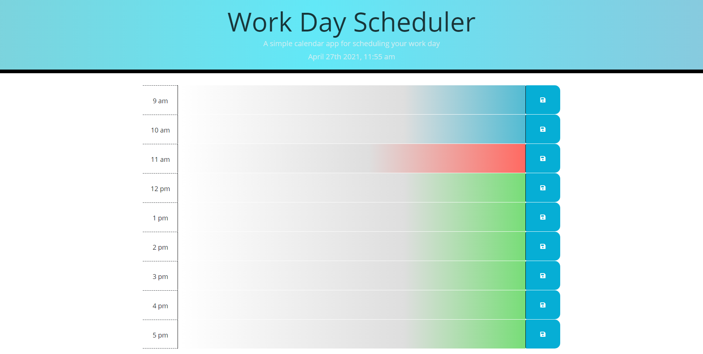

# Scheduler/TODO list
---
## LINKS:
deployed - https://twistedmouse.github.io/Daily-Scheduler/ 

<br>

repo - https://github.com/Twistedmouse/Daily-Scheduler

---

<br>

## DESCRIPTION: 

<p>I was tasked to create a scheduler / TODO list. That changes colour based on priority/time. Blue is the past, Red is the present, 
Green is the future or still coming up.</p> 

<p>When you input a reminder in the text box it will stay in the box even if the page is refreshed. </p>

---

<br>

### User story: 

```md
AS AN employee with a busy schedule
I WANT to add important events to a daily planner
SO THAT I can manage my time effectively
```
### Acceptance Criteria:

```md
GIVEN I am using a daily planner to create a schedule
WHEN I open the planner
THEN the current day is displayed at the top of the calendar
WHEN I scroll down
THEN I am presented with timeblocks for standard business hours
WHEN I view the timeblocks for that day
THEN each timeblock is color coded to indicate whether it is in the past, present, or future
WHEN I click into a timeblock
THEN I can enter an event
WHEN I click the save button for that timeblock
THEN the text for that event is saved in local storage
WHEN I refresh the page
THEN the saved events persist
```

<b>



---

<br>

## TECH:

- HTML
- Css
- javascript
- bootstrap grid https://getbootstrap.com/docs/5.0/layout/grid/
- MomentJS
- Jquery  
- local storage 

---

<br>

## DESIGN: 
<p>terms of design i didn't want it to be to loud or over to top. so i went from a moving gradient in the header/jumbotron.</p>
<p>Starting from blue the primary colour on the page (saveBtn and past are blue) the gradient then moves into a light grey colour </p>
<p>into a purply violet and back to a grey color. This pattern is to feel soothing for the user as a todo list should be simple to 
look at and easy to use.   </p>

---

<br>

## SCREENSHOTS:


---

<br>

